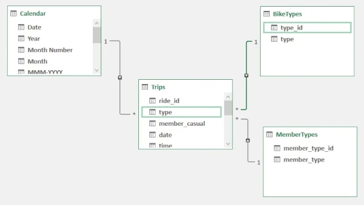
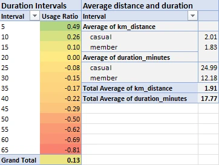
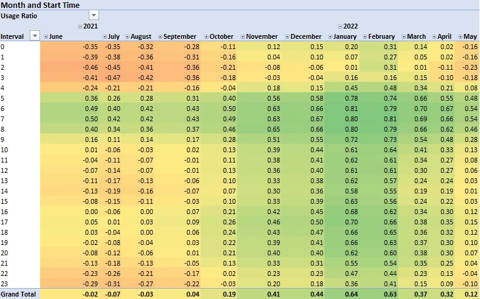
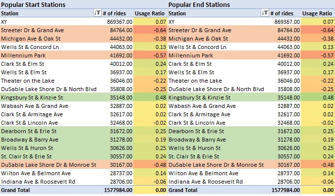
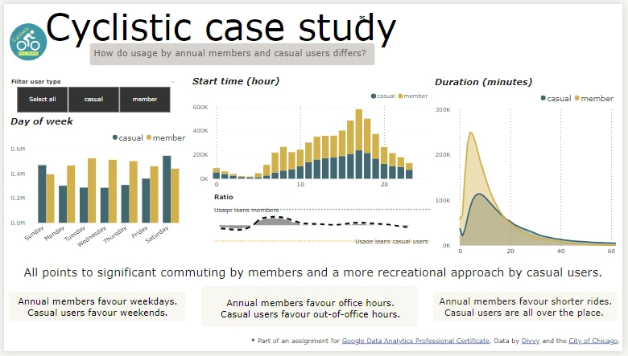
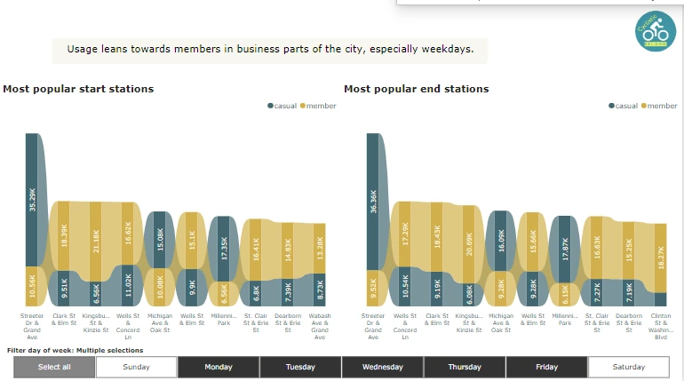
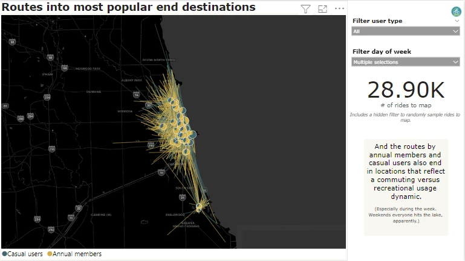

# Cyclistic Trilogy, Track B (Excel → Power BI)
## Executive Summary
I used data about Cyclistic's (a fictitious bike-share company, based on Divvy Chicago) rides and stations to understand differences in bike usage between casual users and annual members.

* Excel file [here](https://drive.google.com/file/d/14y2f-Jsz1NeM4WtcE7EzPShGAFRpHYeF/view?usp=sharing){:target="_blank"}.
* Power BI file [here](https://drive.google.com/file/d/1F-VfvTpqTKDoa_HCL8mPjBSedQcoFZBe/view?usp=sharing){:target="_blank"}.

## Structure
The case study is part of [Google Data Analytics Professional Certificate](https://www.coursera.org/professional-certificates/google-data-analytics). I therefore used Google’s approach to data analysis, composed of six phases: ask, prepare, process, analyse, share, and act.

To learn about and compare different tools, I performed the analysis three times, each with different tools: (1) SQL → Google Spreadsheets → Tableau, (2) Excel → Power BI, (3) Python → MicroStrategy.

This document details the second track, **Excel → Power BI**.


*Figure 1: Methodology (based on Google's data analysis approach).*

## Analysis

### Stage 1 (Ask)
**Business problem.** Cyclistic launched a bike-share offering in Chicago in 2016, which grew to 5,824 bikes across many stations. Cyclistic has three pricing plans: single-ride passes, full-day passes, and annual memberships. Annual memberships are most profitable, so there is interest in a marketing campaign to sell more annual memberships.

**Business task.** Lily Moreno, Cyclistic’s Director of Marketing, believes the campaign should aim to convert users of single-ride and full-day passes (casual users) into annual members. To design the campaign, she wants to better understand, among other things, how annual members and casual riders use Cyclistic bikes differently?

**Stakeholders.** Table 1 summarises people/groups who are or could be interested in this project.

*Table 1: Project stakeholders.*

| Stakeholder | Notes |
| ------ | ------- |
|	Lily Moreno (Director of Marketing) | Responsible for the marketing campaigns and directly involved with this project. |
|	Cyclistic's Marketing Analytics Team | Responsible for collecting, analysing, and reporting data that helps guide Cyclistic’s marketing—could offer feedback and support. |
|	Cyclistic's Executive Team | In charge of Cyclistic’s wider strategy and sufficiently detail-oriented as to look closely at data analyses. Recommendations must be approved by them. |
|	Cyclistic’s users | Potentially affected by any changes to the service.  |
|	Chicago inhabitants | Potentially interested in or critical of the intended marketing campaign.  |

### Stage 2 (Prepare)
**Data sources.** The data pack included [12 CSV files](https://divvy-tripdata.s3.amazonaws.com/index.html) with Cyclistic rides for the past 12 months.

**Data applicability.** Cyclistic is a fictitious company, but data comes from [Divvy](https://ride.divvybikes.com/), a real-world bike-share programme in Chicago run by Lyft and owned by the Chicago Department of Transportation. So, data does seem to offer a meaningful window into the activities of a bike-share programme, including usage differences between different types of riders.

**Data ethics.** The data is already publicly available from [Divvy](https://ride.divvybikes.com/data-license-agreement). My usage is unlikely to increase ethical risks. Also, Divvy is covered by Lyft’s privacy policy, which, to my knowledge, complies with best practices and applicable regulation. Also, the data does not contain personal identifiable information (PII). Biases remain plausible, nonetheless. For instance, more demographic data is needed to determine if data is diverse and avoid analysis that reproduces pre-existing societal biases. Additional research on this matter is recommended.

**Data structure.** Table 2 summarises the structure, content, and main shortcomings of data files.

*Table 2: Structure and contents of data files.*

| Header | Content | Shortcomings |
| ------ | ------- | ------------ |
| **Trips files** || || |
| ride_id | Ride identifier (unique) | |
| rideable_type | Classic/electric | |
| started_at | Timestamp | | 	
| ended_at | Timestamp | |
| start_station_name | Name of station | Many empty entries. Station names match trips file, but station IDs do NOT. |
| start_station_id | Station ID | |
| end_station_name | Name of station | |
| end_station_id | Station ID | |
| start_lat | Latitude | Entries for rides from/to the same station vary slightly (perhaps due to refering to bikes’ exact location rather than station's). Differences are small and not an analytical problem, but they could complicate visualisation (especially if working with samples). |
| start_lng | Longitude | Same as above. |
| end_lat | Latitude |  Same as above. |
| end_lng | Longitude |  Same as above. |
| member_casual | Casual/annual	| |

**Data integrity and credibility.** Thus, as summarised in table 3, while most integrity and credibility best practices are met, the null values in station columns need to be clarified and, if needed, addressed.

*Table 3: Summary of data integrity and credibility.*

| Type | Description |
| ------ | ------- |
| **Physical integrity** || |
| Accuracy | Data seems to come from sensors, with start/end times by the second and exact coordinates for each ride. |
| Completeness | Most columns are complete, but there are many empty values in stations columns. |
| Consistency | All files with data about trips follow a similar logic/structure. |
| **Logical integrity** || |
| Entity | All rides in the trips data have a unique identifier. |
| Referential | No problems were identified. |
| **Credibility (ROCCC)** || |
| Reliable | Cyclistic is a fictional company, but Divvy is a real bike-share programme. Data can be considered internal and therefore reliable. |
| Original | Data is created upon usage, i.e., it comes from origin. |
| Comprehensive | Data offers a ride-by-ride overview of all trips. It is very comprehensive. |
| Current | Data offers insight into very recent rides and is therefore very current. |
| Cited | Data was cited by Google in its flagship data analysis certification programme. Additionally, Divvy is a salient bike-sharing programme. |

### Stage 3 (Process)
Access the Excel file for thsi and the next stage [here](https://drive.google.com/file/d/14y2f-Jsz1NeM4WtcE7EzPShGAFRpHYeF/view?usp=sharing).

**Trips data.** The first step was to load all trips data via Power Query, which was also an opportunity use M to:
* check for and remove rows with empty values in columns other than station names/ids;
* remove duplicates ride ids;
* trim, clean, and remove other unnecessary characters from string columns (footnotes, suffixes, etc.);
* relabel type and member_casual columns with short-format identifiers (for faster computation),
* relabel headers (for clarity);
* remove station IDs columns (will not be needed);
* double check data types;
* create a calculated duration column (easier to interpret than end time);
* and delete the end time column (having both end time and duration is redundant).

``` (Power Query) M
let
    Source = Folder.Files("C:\Users\jboln\Documents\_Work\Portfolio\Data Analysis\cyclisticTrilogy\trackB\data\Trips"),
    #"Filtered Hidden Files1" = Table.SelectRows(Source, each [Attributes]?[Hidden]? <> true),
    #"Invoke Custom Function1" = Table.AddColumn(#"Filtered Hidden Files1", "Transform File", each #"Transform File"([Content])),
    #"Renamed Columns1" = Table.RenameColumns(#"Invoke Custom Function1", {"Name", "Source.Name"}),
    #"Removed Other Columns1" = Table.SelectColumns(#"Renamed Columns1", {"Source.Name", "Transform File"}),
    #"Expanded Table Column1" = Table.ExpandTableColumn(#"Removed Other Columns1", "Transform File", Table.ColumnNames(#"Transform File"(#"Sample File"))),
    #"Changed Type" = Table.TransformColumnTypes(#"Expanded Table Column1",{{"Source.Name", type text}, {"ride_id", type text}, {"rideable_type", type text}, {"started_at", type datetime}, {"ended_at", type datetime}, {"start_station_name", type text}, {"start_station_id", type text}, {"end_station_name", type text}, {"end_station_id", type text}, {"start_lat", type number}, {"start_lng", type number}, {"end_lat", type number}, {"end_lng", type number}, {"member_casual", type text}}),
    #"RM Import Cols" = Table.RemoveColumns(#"Changed Type",{"Source.Name"}),
    #"Rename Cols" = Table.RenameColumns(#"RM Import Cols",{{"rideable_type", "type"}, {"started_at", "start_time"}, {"ended_at", "end_time"}, {"start_station_name", "start_station"}, {"end_station_name", "end_station"}}),
    #"RM Station IDs" = Table.RemoveColumns(#"Rename Cols",{"start_station_id", "end_station_id"}),
    Trim = Table.TransformColumns(#"RM Station IDs",{{"ride_id", Text.Trim, type text}, {"type", Text.Trim, type text}, {"start_station", Text.Trim, type text}, {"end_station", Text.Trim, type text}, {"member_casual", Text.Trim, type text}}),
    Clean = Table.TransformColumns(Trim,{{"ride_id", Text.Clean, type text}, {"type", Text.Clean, type text}, {"start_station", Text.Clean, type text}, {"end_station", Text.Clean, type text}, {"member_casual", Text.Clean, type text}}),
    #"RM Duplicate Ride IDs" = Table.Distinct(Clean, {"ride_id"}),
    #"ReLabel Type Electric" = Table.ReplaceValue(#"RM Duplicate Ride IDs","electric_bike","2",Replacer.ReplaceText,{"type"}),
    #"ReLabel Type Classic" = Table.ReplaceValue(#"ReLabel Type Electric","classic_bike","1",Replacer.ReplaceText,{"type"}),
    #"ReLabel Type Docked" = Table.ReplaceValue(#"ReLabel Type Classic","docked_bike","3",Replacer.ReplaceText,{"type"}),
    #"ReLabel Casual" = Table.ReplaceValue(#"ReLabel Type Docked","casual","1",Replacer.ReplaceText,{"member_casual"}),
    #"ReLabel Member" = Table.ReplaceValue(#"ReLabel Casual","member","2",Replacer.ReplaceText,{"member_casual"}),
    #"Add Duration Col" = Table.AddColumn(#"ReLabel Member", "duration", each [end_time]-[start_time]),
    #"ReOrder 2" = Table.ReorderColumns(#"Add Duration Col",{"ride_id", "type", "start_time", "end_time", "duration", "start_station", "end_station", "start_lat", "start_lng", "end_lat", "end_lng", "member_casual"}),
    #"RM End Time" = Table.RemoveColumns(#"ReOrder 2",{"end_time"}),

    /* [continues below...]

```

There was still a need to figure out the empty station names, though.

It took some research, but I did find out that the null station names correspond to electric bikes. Electric bikes can be docked at docking stations, but they also have a mechanism to leave the bike locked elsewhere, for example, at a bike rack ($2 charge applies).

*Table 3: Total rides*

| *Type* | *Rides (#) [% of total}* | *NULL start station (#)* | *NULL end station (#)* |
| ---- | ----------------------- | ---------- | ---------------- |
| classic | 3,217,737 [54.90%] | 0 | 8,081* |
| docked | 274,447 [4.68%] | 0 | 890* |
| electric | 2,368,592 [40.41%] | 823,167 | 869,367 |
| * Likely, improperly docked, lost, or stolen—can be ignored. || || |

I also learned that while the dataset contains classic, docked, and electric ride categories, Cyclistic (Divvy) only has two bike types: classic and electric. The docked label dates to before electric bikes were introduced and, thus, likely refers to non-electric bikes. It can be recoded as classic.

Accordingly, I adjusted the transformation to:
* Relabel 'docked' types to 'classic';
* Discard trips of type 'classic' for which end station is NULL (using a calculated column and then a filter);
* Relabel all remaining empty station names as "XY" to avoid problems during the analysis (*in hindsight, I should have picked a better label, but this did not affect the analysis, so it is what it is.*).

``` (Power Query) M
/* [... continues from above]

    #"ReLabel Docked to Classic" = Table.ReplaceValue(#"RM End Time","3","1",Replacer.ReplaceText,{"type"}),
    #"ADD string for Conditional Col" = Table.ReplaceValue(#"ReLabel Docked to Classic","",null,Replacer.ReplaceValue,{"end_station"}),
    #"Add Conditional Col" = Table.AddColumn(#"ADD string for Conditional Col", "TEMP", each if [type] = 2" then "OK" else if [end_station] = null then "EXCLUDE" else "OK"),
    #"ReOrder 3" = Table.ReorderColumns(#"Add Conditional Col",{"ride_id", "type", "TEMP", "start_time", "duration", "start_station", "end_station", "start_lat", "start_lng", "end_lat", "end_lng", "member_casual"}),
    #"Filter Conditional Col" = Table.SelectRows(#"ReOrder 3", each ([TEMP] = "OK")),
    #"RM Conditional Col" = Table.RemoveColumns(#"Filter Conditional Col",{"TEMP"}),
    #"ReLabel End Station NULLs" = Table.ReplaceValue(#"RM Conditional Col",null,"XY",Replacer.ReplaceValue,{"end_station"}),
    #"ReLabel Start Station NULLs" = Table.ReplaceValue(#"ReLabel End Station NULLs","","XY",Replacer.ReplaceValue,{"start_station"}),

    /* [continues below...]

```
The transformation took a bit to load into the Data Model. Once it loaded, however, I could work with the full dataset without unreasonable delays.

Just when I thought I was ready to start analysing, I remembered start time are given as timestamps. It is best to separate this column into date and time columns (to use a separate calendar and, if needed, time tables). So, I adjusted the transformation one last time.

``` (Power Query) M
/* [... continues from above]

    #"Duplicated Column" = Table.DuplicateColumn(#"ReLabel Start Station NULLs", "start_time", "start_time - Copy"),
    #"Extracted Time" = Table.TransformColumns(#"Duplicated Column",{{"start_time - Copy", DateTime.Time, type time}}),
    #"Extracted Date" = Table.TransformColumns(#"Extracted Time",{{"start_time", DateTime.Date, type date}}),
    #"Renamed Columns" = Table.RenameColumns(#"Extracted Date",{{"start_time", "date"}, {"start_time - Copy", "time"}}),
    #"Reordered Columns" = Table.ReorderColumns(#"Renamed Columns",{"ride_id", "type", "member_casual", "date", "time", "duration", "start_station", "end_station", "start_lat", "start_lng", "end_lat", "end_lng"})
    in
    #"Reordered Columns"

```

**Tidying up.** To ensure a smooth analysis, I created a few additional tables and relationships:
* calendar table for easier hierarchies,
* bike type table to reduce the size of the main table,
* and user/rider type table (same reason).



*Figure 2. Screenshot of final Excel Data Model.*

### Stage 4 (Analyse)
**Calculated columns and measures.** To expedite analysis, I used DAX to create additional calculated columns and some measures:
* [column] start_time_hour: start time (hour of day);
* [column] duration_minutes: ride duration in minutes;
* [column] duration_intervals: ride duration in 5-min intervals;
* [column] distance: lenght of trip in kilometers;
* [measure] pct_member_usage: % rides corresponding to annual members;
* [measure] usage_ratio: a normalised usage ratio ranging from -1 (casual users only) to 1 (annual members only), centred at 0 (balanced usage).

*(The first two columns I should have probably done directly in the transformation, but I figured it was a good opportunity to show some DAX).*

``` DAX

// Duration in minutes
minute_duration =
  VAR duratio = VALUE([duration]) // This was needed because the duration column was laoded as text (and faster than adjusting the original transformation).
  RETURN
    60*HOUR(duratio)+MINUTE(duratio)

// Duration intervals
duration_intervals =
  SWITCH(
    TRUE(),
  	[minute_duration] <= 5, 5,
  	[minute_duration] <= 10, 10,
  	[minute_duration] <= 15, 15,
  	[minute_duration] <= 20, 20,
  	[minute_duration] <= 25, 25,
  	[minute_duration] <= 30, 30,
  	[minute_duration] <= 35, 35,
  	[minute_duration] <= 40, 40,
  	[minute_duration] <= 45, 45,
  	[minute_duration] <= 50, 50,
  	[minute_duration] <= 55, 55,
  	[minute_duration] <= 60, 60,
  	65
)

// Distance
  km_distance =
  VAR dxLng = RADIANS([end_lng]) - RADIANS([start_lng])
  VAR dxLat = RADIANS([end_lat]) - RADIANS([start_lat])
  VAR A = POWER(SIN(dxLat / 2),2) + (COS([start_lat]) * COS([end_lat]) * POWER(SIN(dxLng / 2),2))
  VAR Distance = (2 * ASIN(SQRT(A))) * 6371
  Return
    Distance

// Percentage of rides by annual members
pct_member_usage =
  CALCULATE(COUNT([member_casual]), Trips[member_casual] = "2") / [Count of ride_id]


// Usage ratio
usage_ratio =
  VAR memTrips = CALCULATE(COUNT([member_casual]), Trips[member_casual] = "2")
  VAR casTrips =CALCULATE(COUNT([member_casual]), Trips[member_casual] = "1")
  RETURN
    (memTrips - casTrips) / (memTrips + casTrips)


```

**Bare knuckles data analysis via Pivot Tables.** After this, analysis was rather easy. This is, indeed, why using  Excel as a prelude to Power BI can be helpful. If the data is appropriately prepared, it is possible to learn a lot from it by pivoting around a bit.

Below a screenshot of the most insightful pivot tables I generated. They suggest that:
* members tend to have shorter rides and lower ride durations;
* members tend to use bikes in winter significantly more than casual users;
* members are particularly active during business hours, especially in weekdays, especially between 5 and 10 am;
* and that popular stations leaning towards usage by members are in business parts of the city, while those leaning towards usage by casual users are in recreational areas.

*(I did not find significant differences in usage of electric bikes. Members tend to stick to classic bikes a little more than casual users, which may be because there is a charge to pay even for members. However, the differences are a tad too small as to make sound conclusions. With this small exception noted, usage patterns for electric bikes are similar than for classic bikes.)*

The common patter that emerges is that the programme is characterised by business-like usage by annual members and recreational usage by casual users.




*Figure 3. Duration and distance of rides, with usage ration by 5-min intervals.*

..



*Figure 4. Date (month) and time (hour of day) of rides.*

..


*Figure 5. Day (of week) and time (hour of day) of rides.*

..



*Figure 6. Number of rides and usage ratio of the most popular stations.*

### Stage 5 (Share)
Access the Power BI file for this stage [here](https://drive.google.com/file/d/1F-VfvTpqTKDoa_HCL8mPjBSedQcoFZBe/view?usp=sharing).

**PowerBI.** I was now in a position to use visualisation to further what I found in a way that also allows communicating the message easily. The geographical nature of the analysis implied the need for some maps. Excel is not great with maps. It was time for Power BI.

The first step was to import the data model into Power BI: File > Import > Power Query, Power Pivot.
* I had to clean the imported model a little before starting the visualisation.
* Also, I got rid of the distance measure and the percentage usage (NOT the same as the usage ratio—which I kept). At the end of the day, these two measures did not add much to the analysis.

I had gotten all the cleaning and data analysis steps done using M and DAX in Excel. So, the PowerBI share of the analysis was rather straightforward. Drag stuff. Make it pretty. Drag more stuff.

I created a couple bar charts and a line chart to show the differences in usage by
* day of week;
* time of day;
* and duration (coupled with an area chart to highlight the 5-10am member-rush via the usage ratio).

I also added a couple ribbon charts to visualise difference in usage of popular end stations.

Additionally, I also created a map with routes and destinations, tied to a couple slicers to visualise usage differences by members and casual users in different days of the week.

The map is a 'Flow Map', which is not a standard Power BI visual. I began by importing the visual. Then, I created three calculated columns to facilitate analysis (and reduce wait times every time the map is changed via a slicer).
* Origin and destination locations from the coordinates in the dataset.
* A combo duplicate-check and randomiser column, which
  * checks for and excludes rides that started and ended in the same place (system bugs or people who decided not to take the ride or change bike for one reason or another)
  * flags a semi-random share of rides with the string "OK", which allows pre-filtering rides before rendering the map, which avoids the map having to render millions of rides each time the visualisation changes.

``` DAX

// Origin and destination locations
start_coordinates =
  CONCATENATE(Trips[start_lat], CONCATENATE(", ", Trips[start_lng]))
end_coordinates =
  CONCATENATE(Trips[end_lat], CONCATENATE(", ", Trips[end_lng]))

// Randomiser
check_duplicate_coords =
  IF(Trips[start_lat]<>Trips[end_lat], if(Trips[start_lng]<>Trips[end_lng], IF(RANDBETWEEN(0,1000)<10, "OK", "OUT OF SAMPLE"), "DUPLICATE"), "DUPLICATE")

```

Below are some screenshots of the Power BI visualistion. However, you can download [this file](https://drive.google.com/file/d/1F-VfvTpqTKDoa_HCL8mPjBSedQcoFZBe/view?usp=sharing) and open it in Power BI to see and use the interactive dashboards.



*Figure 7: Snapshot of dashboard.*



*Figure 8: Snapshot of dashboard.*



*Figure 9: Snapshot of dashboard.*

## Recommendations
### Stage 6 (Act)
To summarise, while annual members use the bike-share programme for significant commuting purposes, casual users tend to use Cyclistic’s bike-share programme in a recreational fashion.

Based on this finding and the analysis, three recommendations are possible:
*	At the strategic level, acknowledge that casual users are unlikely to use bikes as much as needed to offset the cost of an annual membership.
* At the messaging level, focus the marketing campaign on convenience rather than cost.[^1]
  * Example (Chicago inhabitants). No need to worry about logistics when running late to a picnic.
  * Example (Visitors). No need to figure out things while trying not to get lost in a new city.
*	Be playful. Strike a jovial tone in all marketing. Casual users already know the programme. The challenge is not communicating the existence of annual memberships but, rather, selling an experience.

#### Footnotes
[^1]: The exception being the additional charge for electric bikes, which applies to members. I fail to see the point of paying for a membership that does not cover the cool bikes. One would think scrapping this charge for members is a rather easy way to attract more people into annual memberships. That said, as noted in the analysis, the data does not show the level of differences needed to make sound conclusions about this particular aspect of bike usage. Also, making a conclusion on this matter would require comparing the income that the additional charge brings against the realistic expectations of additional annual members from scrapping the charge. Additional research on this aspect of activities is recommended.
